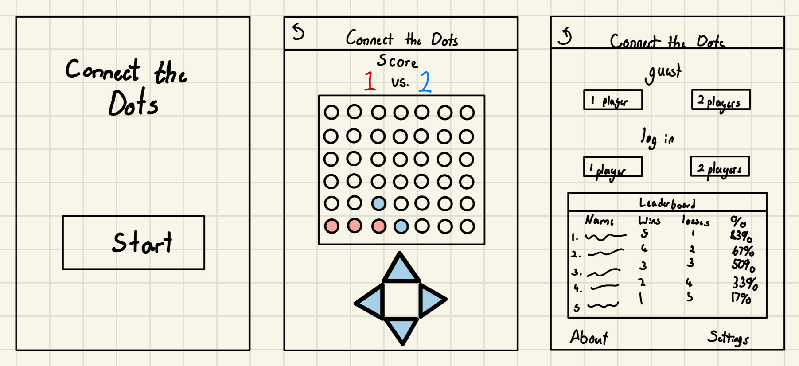
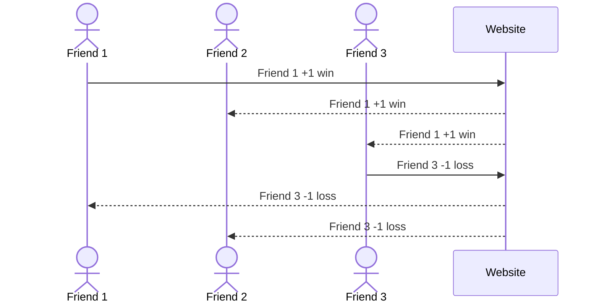

# Connect the Dots

[My Notes](notes.md)

A brief description of the application here. Lorem ipsum dolor sit amet, consectetur adipiscing elit, sed do eiusmod tempor incididunt ut labore et dolore magna aliqua. Ut enim ad minim veniam, quis nostrud exercitation ullamco laboris nisi ut aliquip ex ea commodo consequat. Duis aute irure dolor in reprehenderit in voluptate velit esse cillum dolore eu fugiat nulla pariatur. Excepteur sint occaecat cupidatat non proident, sunt in culpa qui officia deserunt mollit anim id est laborum. hopefully this description has been modified. will this change work again? Test again.

This will be a simple application where anyone who has accses to it can play a simple game of Connect 4 anywhere they want. They can either play with themselves against a computer that will randomly place down their dots or against a friend in person with each person taking turns. You can either play as a guest or log in with your information to keep track of you and your friends' scores as well.

> [!NOTE]
>  This is a template for your startup application. You must modify this `README.md` file for each phase of your development. You only need to fill in the section for each deliverable when that deliverable is submitted in Canvas. Without completing the section for a deliverable, the TA will not know what to look for when grading your submission. Feel free to add additional information to each deliverable description, but make sure you at least have the list of rubric items and a description of what you did for each item.

> [!NOTE]
>  If you are not familiar with Markdown then you should review the [documentation](https://docs.github.com/en/get-started/writing-on-github/getting-started-with-writing-and-formatting-on-github/basic-writing-and-formatting-syntax) before continuing.

## 🚀 Specification Deliverable

> [!NOTE]
>  Fill in this sections as the submission artifact for this deliverable. You can refer to this [example](https://github.com/webprogramming260/startup-example/blob/main/README.md) for inspiration.

For this deliverable I did the following. I checked the box `[x]` and added a description for things I completed.

- [x] Proper use of Markdown
- [x] A concise and compelling elevator pitch
- [x] Description of key features
- [x] Description of how you will use each technology
- [x] One or more rough sketches of your application. Images must be embedded in this file using Markdown image references.

### Elevator pitch

Have you ever wanted to play a simple but addictive online game similar to Google's Tic Tac Toe but tired of the it at the same time? Well here's a new simple way to play Connect 4 on any device with internet compatibility anywhere you want. Connect the Dots is a simple application where you can either play againts a random computer or with friends in person. You can practice your Connect 4 skills as many times as you want or use it as a quick distraction. You can even have small competitions with your friends thanks to the easy to see scoreboard that will keep track of your wins/losses and calculate your win percentage.

### Design

In the image above, you can see a rough sketch of the design of the application. This is a rough draft so many things may change.

Down below, you can see how a user will interact with the server which will hold the scoreboards.

### Key features

- Ability to play Connect 4 as a guest or logged in
- Single play or multiplay
- Secure login
- Updated scoreboards with correct scores (wins/losses/percentage)
- Controls for easy dot selection

### Technologies

I am going to use the required technologies in the following ways.

- **HTML** - Will use 3-4 HTML pages for starting page, multiplayer select/scoreboard page, game page, and a fourth extra page for either an about us, settings page, or something that could improve the userbility.
- **CSS** - A nice, simple, and clean UI that can easily be switch between a light or dark mode without dramaticly changing things. 
- **React** - Presseble buttons to enter the application, to choose type of game, to login, and controls to move the dots left or right.
- **Service** - Connects to server to store and retrieve login and scoreboard information.
- **DB/Login** - Stores the users names and their scores when logged in.
- **WebSocket** - Once a game for a logged in user has finished, their score will be uploaded, calculated, and then displayed to all users in the scoreboard.

## 🚀 AWS deliverable

For this deliverable I did the following. I checked the box `[x]` and added a description for things I completed.

- [x] **Server deployed and accessible with custom domain name** - [connectthedots.com](https://connectthedots.click).

## 🚀 HTML deliverable

For this deliverable I did the following. I checked the box `[x]` and added a description for things I completed.

- [x] **HTML pages** - Created 3 HTML files and uploaded them
- [x] **Proper HTML element usage** - Seperated everything using body, header, section, and footer
- [x] **Links** - I have links that link to the html pages and to my github
- [x] **Text** - Added text like my title, button names, and temporary description.
- [x] **3rd party API placeholder** - The leaderboard is the placeholder which will update with scores
- [x] **Images** - Currently have a temporary (or placeholder) image for what I want the C4 board to look like
- [x] **Login placeholder** - Have temporary buttons for log in which are currently linked to play html file
- [x] **DB data placeholder** - The leaderboard is also the placeholder for this as well which will get updated
- [x] **WebSocket placeholder** - The leaderboard again as its going to be recieving data to show the scores

## 🚀 CSS deliverable

For this deliverable I did the following. I checked the box `[x]` and added a description for things I completed.

- [x] **Header, footer, and main content body** - The header is permanently at the top of the page, the footer is permanently at the bottom, and the main is in the middle taking up all the space that the header and footer don't use. Many of the objects in each section have been all centered and moved around using mostly css (some minor things I changed in the html file instead).
- [x] **Navigation elements** - At the header is a back button that takes you to the previous page (index <- select <- play) and at the bottem in the footer are some navigation buttons to some extra pages (About, Settings, and the Github link).
- [x] **Responsive to window resizing** - When window resizes, the content stays centered in their respective areas.
- [x] **Application elements** - Instead of links for the player select, back link, and the to enter link, they've been changed to bootstrap buttons.
- [x] **Application text content** - Font was chosen (sans serif) and text size has been changed for some of the text.
- [x] **Application images** - Temporary image of c4 board still in use

### Extra

During this deliverable, I had also changed some of the format and tags from the previous deliverable like moving the h1 tag in index.html from the header to the main body. Or how I change several of the p tags to div tags to be able to stylize better. As well as added two more html pages for "About" and "Settings" with temporary text. Made sure to stylize it a bit with css as well, even though the text is temporary.

## 🚀 React part 1: Routing deliverable

For this deliverable I did the following. I checked the box `[x]` and added a description for things I completed.

- [ ] **Bundled using Vite** - I did not complete this part of the deliverable.
- [ ] **Components** - I did not complete this part of the deliverable.
- [ ] **Router** - I did not complete this part of the deliverable.

## 🚀 React part 2: Reactivity deliverable

For this deliverable I did the following. I checked the box `[x]` and added a description for things I completed.

- [ ] **All functionality implemented or mocked out** - I did not complete this part of the deliverable.
- [ ] **Hooks** - I did not complete this part of the deliverable.

## 🚀 Service deliverable

For this deliverable I did the following. I checked the box `[x]` and added a description for things I completed.

- [ ] **Node.js/Express HTTP service** - I did not complete this part of the deliverable.
- [ ] **Static middleware for frontend** - I did not complete this part of the deliverable.
- [ ] **Calls to third party endpoints** - I did not complete this part of the deliverable.
- [ ] **Backend service endpoints** - I did not complete this part of the deliverable.
- [ ] **Frontend calls service endpoints** - I did not complete this part of the deliverable.
- [ ] **Supports registration, login, logout, and restricted endpoint** - I did not complete this part of the deliverable.

## 🚀 DB deliverable

For this deliverable I did the following. I checked the box `[x]` and added a description for things I completed.

- [ ] **Stores data in MongoDB** - I did not complete this part of the deliverable.
- [ ] **Stores credentials in MongoDB** - I did not complete this part of the deliverable.

## 🚀 WebSocket deliverable

For this deliverable I did the following. I checked the box `[x]` and added a description for things I completed.

- [ ] **Backend listens for WebSocket connection** - I did not complete this part of the deliverable.
- [ ] **Frontend makes WebSocket connection** - I did not complete this part of the deliverable.
- [ ] **Data sent over WebSocket connection** - I did not complete this part of the deliverable.
- [ ] **WebSocket data displayed** - I did not complete this part of the deliverable.
- [ ] **Application is fully functional** - I did not complete this part of the deliverable.
